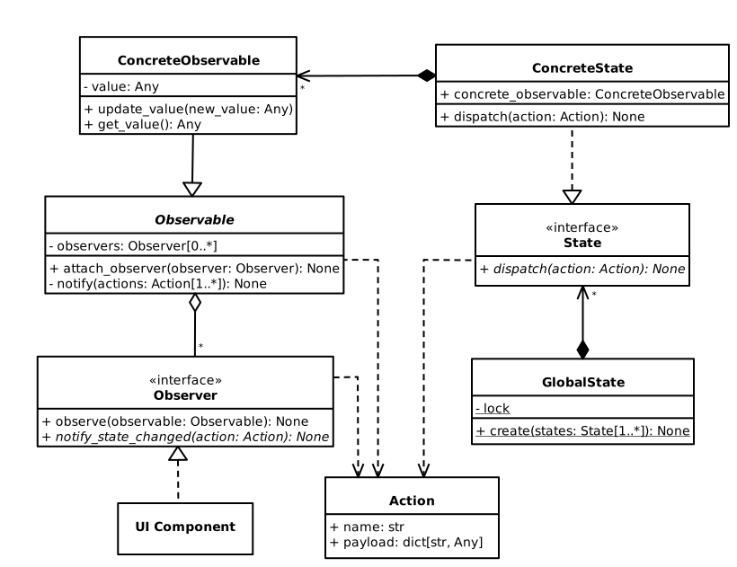

# GSO (Global State Observer)

GSO is an open-source Python library for managing application state.
It uses a modified version of the [Observer pattern](https://en.wikipedia.org/wiki/Observer_pattern) 
to sync UI state with application state.

GSO was originally designed to work with [PySide](https://wiki.qt.io/Qt_for_Python)/[PyQt](https://riverbankcomputing.com/software/pyqt/),
but it works well with pretty much every class-based UI library out there.

## How to use

You will find a lot of [examples](https://github.com/youssef-attai/gso/tree/main/examples)
that can help you get started.
The examples are very simple, they are all focused on 
the pattern that works best with GSO.

You are encouraged to clone the ones that use the UI library you are working with
and have a closer look.

### Flow

****
⚠ **All the following is outdated.** ⚠
****

In GSO, application state is encapsulated in 
user-defined observables. An observable is like
a wrapper around the actual state or variable, that
helps make application state and UI state synced together.

All an observable brings to the table is that it keeps references to objects that are
interested in knowing when the wrapped state changes.

Observables provide **one and only one** way to update encapsulated state, and
in this way, observers are notified after the update happens so
that they can update their own state accordingly.

All UI components that depend on at least one variable in
application state should implement the `Observer` interface.
Each of these variables should be encapsulated in
a class that extends the `Observable` class. 

Now UI components are able to observe the observables they
depend on, using the `observe()` method on `Observer`
instances (or `attach_observer()` on `Observable` instances),
and implement the `notify_state_changed()` method to react
accordingly when an observable state changes.

That was the O in GSO, the Observer pattern.

You might be thinking, how do UI components reach
the observables? Well, that's where the GS comes to play.

First, all related observables should be encapsulated together
in a class that implement the `State` interface.

`State` classes should implement the `dispatch()`
method, which is what UI components are going to use
to request an update in state (usually due to
some kind of UI event). The `dispatch()` method
should handle changing the observables' states based on the
dispatched `Action` (more on `Action`s later).

Then, the `GlobalState` class is used to group all `State` classes 
and make them globally available everywhere in your code, 
so that UI components can easily dispatch actions and request 
state updates. 

Grouping `State` classes is done using the
`GlobalState`'s public class method `create()`, which can only
be called once at the very beginning of your application, to
initialize and prepare application state.

That was the GS in GSO, the `GlobalState` class.

As you already know, an observable can have multiple observers.
Also, an observer can observe multiple observables.

In other words, one variable in application state
can have multiple UI components depending on it,
and one UI component can have it's state depend on multiple
variables in application state, which is why
the `notify_state_changed()` method on `Observer`s
accepts the parameter `action`.

If you are familiar with [Redux](https://redux.js.org/), you already
know what actions are, they are exactly the same in GSO.

Anyway, actions are objects that describe what kind of update 
should take place in both UI components and application state.
Every action should have a unique name, and a payload that
has all what the object being notified with the action needs
to make the corresponding update properly.

If you are familiar with class diagrams, this might be useful: 

****
✓ **This class diagram is updated. Documentation will be updated soon.**
****



## How to install

Make sure you have `pip` installed, then open a terminal window, and type:
```
pip install gso
```
