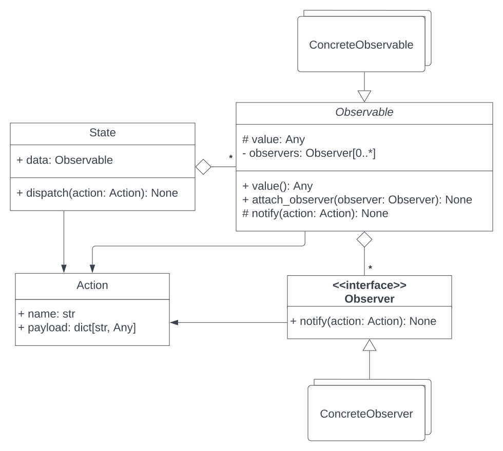

# Global State Observer

GSO is an open-source Python library for managing state. It provides simple interfaces that application data objects and UI components can easily
implement to facilitate syncing them together. It is based on the [Observer pattern](https://refactoring.guru/design-patterns/observer) and inspired
by [Redux.js](https://redux.js.org/).

GSO was originally designed to be used with GUIs built using [PySide](https://en.wikipedia.org/wiki/PySide)/[PyQt](https://en.wikipedia.org/wiki/PyQt), but it should work with any class-based UI thanks to its abstractness.

****
🚧 **GSO is currently under development.**
****

## Installation

Make sure you have `pip` installed, then run the following:

```
pip install gso
```

## How to use

* UI components should:
  * Implement the `Observer` interface.
  * Override the `notify(action)` method to update their UI state based on the `action`.

* Application state should be encapsulated in a class called `State`. 
It should hold all observable pieces of data and have a single public method: `dispatch(action)`.

* The `dispatch(action)` method on the `State` class should be called from the UI components as a result of a user interaction.

* An `Action` is an object that describes a UI event that is fired with the intent of changing application state.

* An `Observable` is any value (or collection of values) in the application state that UI components depend on.

* Any piece of observable data should be:
  * Encapsulated in a class that implements the `Observable` interface.
  * Have any number of methods for updating its values.

* Every update method on an observable piece of data should use the protected member `_value` in updating, and the protected method of the `Observable`
interface: `notify(action)`, to notify all the attached observers with the update.

* UI components should observe the observable pieces of data they depend on, this should be done by calling the `attach_observer(observer)` method on `Observable`s and passing the UI components as arguments.

## Class diagram



## Examples

**More practical examples are yet to be added soon.**

* [Color switcher](./examples/counter)
